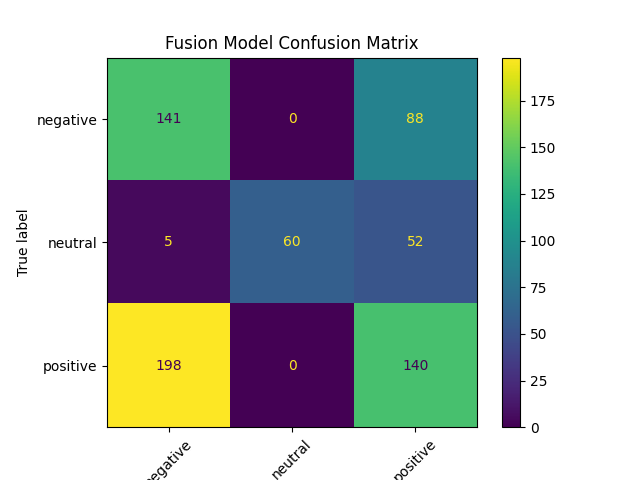

# Multimodal Market Signal Fusion

Entropy-gated multimodal learning pipeline combining:
- Audio feature embeddings
- TF-IDF text modeling
- Market technical indicators
- XGBoost fusion with adaptive confidence gating

## Results
Leak-free chronological evaluation:

- Accuracy: 0.627
- Weighted F1: 0.616

The model demonstrates stable performance despite noisy financial signals,
with strong neutral-class detection and balanced multimodal fusion.

